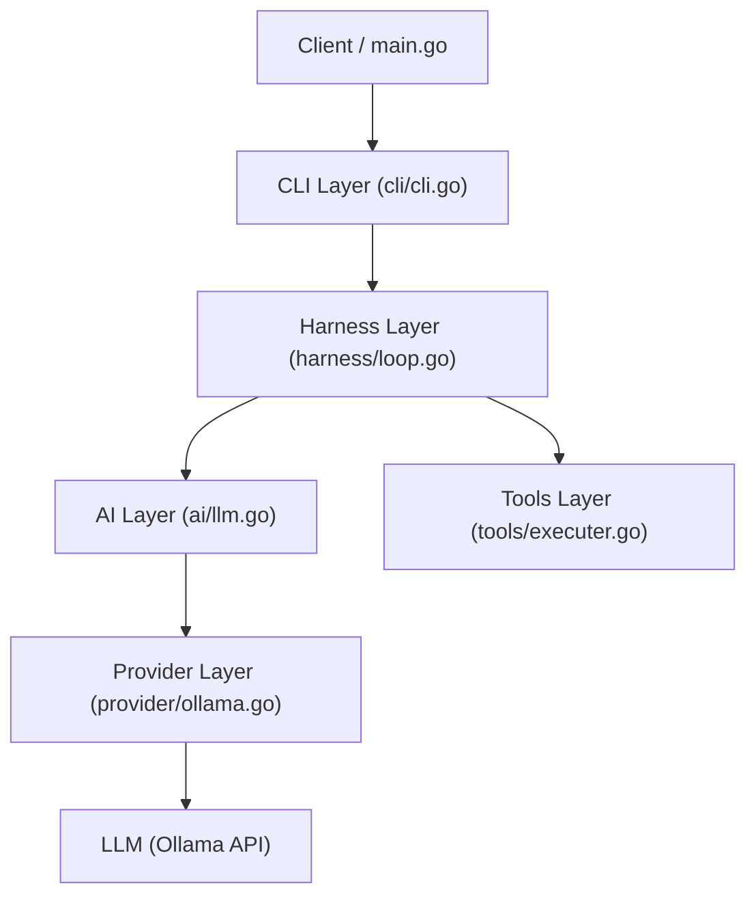
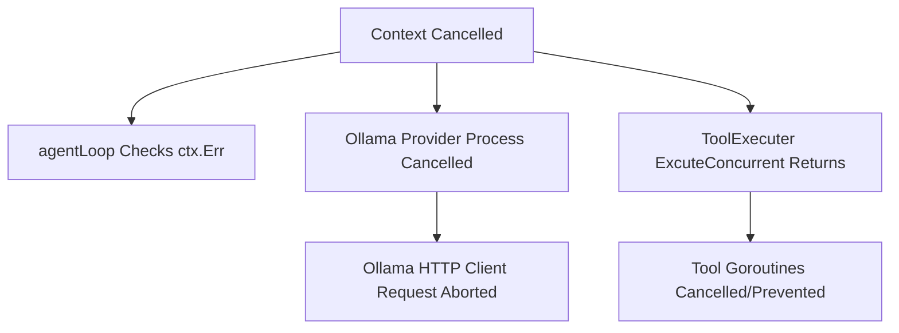

# Zeu Execution Flow & Architecture Specification

This document serves as the design specification detailing the layered architecture, goroutines, channels, and context propagation within the **Zeu Harness**. It is designed to act as a reference base for future design improvements.

---

## 1. Architectural Layers

Zeu is designed as a layered harness separating the agent control loop, external tool integration, and model provider execution.



### A. CLI Layer (`internal/cli`)
- **Core Entities**: `CLI`
- **Responsibilities**: Manages the interactive terminal UI, captures SIGINT (Ctrl+C) signals to cancel execution without stopping the CLI loop, reads user input, and triggers the Harness Layer.

### B. Harness Layer (`internal/harness`)
- **Core Entities**: `Agent`, `State`
- **Responsibilities**: Manages the agent loop, holds conversation history, coordinates calls to the AI Layer, and routes tool calls to the Tools Layer.

### C. AI Layer (`internal/ai`)
- **Core Entities**: `AI`, `Provider`
- **Responsibilities**: Abstract interface for interacting with LLM models. Accepts system prompts, tools lists, and messages to construct provider-independent requests.

### D. Provider Layer (`internal/ai/provider`)
- **Core Entities**: `Ollama`
- **Responsibilities**: Handles connection-level details to local or cloud LLMs. Performs JSON serialization, streams token chunks from model endpoints, and returns normalized token and tool responses.

### E. Tools Layer (`internal/tools`)
- **Core Entities**: `ToolRegistry`, `ToolExcuter`, `Tool`
- **Responsibilities**: Registers custom executable functions and executes tool calls concurrently in dedicated goroutines.

---

## 2. Entity Specifications

| Entity | Location | Purpose | Key Attributes / Methods |
| :--- | :--- | :--- | :--- |
| `CLI` | `internal/cli/cli.go` | Interactive terminal interface loop with cancellation hooks. | `Run()`, `executePrompt(prompt)` |
| `Agent` | `internal/harness/loop.go` | Orchestrates the primary execution loop. | `Invoke(ctx, Prompt)`, `agentLoop(ctx)` |
| `State` | `internal/harness/loop.go` | Stores conversation history and loop details. | `messages []Coversation`, `currIter int` |
| `AI` | `internal/ai/llm.go` | Front-facing manager for model invocations. | `Invoke(ctx, opts...)` |
| `Ollama` | `internal/ai/provider/ollama.go` | Ollama-specific client provider wrapper. | `Process(ctx, req, streamCh)`, `BuildRequest(req)` |
| `ToolRegistry` | `internal/tools/registry.go` | Registry storage of executable tools. | `Register(tools)`, `Get(name)`, `List()` |
| `ToolExcuter` | `internal/tools/executer.go` | Handles sequential and concurrent execution of tool calls. | `Excute(ctx, toolCall)`, `ExcuteConcurrent(ctx, toolCalls)` |

---

## 3. Goroutine and Channel Architecture

Zeu leverages asynchronous programming via Goroutines and Go channels for stream processing and concurrency.

```
       [Client Main]
             │  Invoke(ctx, Prompt)
             ▼
      [agentLoop Goroutine] <───────────────────────┐
             │                                     │ (Loop Iterations)
             ├─► [Ollama Provider Goroutine]       │
             │         │                           │
             │         ├─► streamCh (Text Tokens)  │
             │         └─► resChan (Tool Calls) ───┤
             │                                     │
             ├─► [Concurrent Tools Goroutines]     │
             │         │                           │
             │         └─► wg.Wait() ──────────────┘
             ▼
      [Close streamCh]
```

### Channels Used:
1. `streamCh chan string` (Harness Layer to Client): 
   Created by the Harness Layer. Streams output (text messages, calling tool indicators, and tool execution results) back to the client in real-time.
2. `resChan chan AiResponse` (Provider Layer to Harness Layer):
   Created by the Harness Layer and passed down to `AI.Invoke`. Streams LLM response chunks, parsed tool calls, and execution errors from the Ollama provider to the agent loop.

---

## 4. Layer-to-Layer Interaction Sequence

The diagram below details the end-to-end execution of a user prompt, involving one tool invocation and completion:

```mermaid
sequenceDiagram
    autonumber
    actor User as User
    participant Client as Client/Main
    participant CLI as CLI Layer
    participant Agent as Agent (Harness)
    participant AI as AI Layer
    participant Ollama as Ollama Provider
    participant Executer as Tool Executer
    
    Client->>CLI: Run()
    User->>CLI: Input prompt
    Note over CLI: Creates cancellable Context and captures Ctrl+C
    CLI->>Agent: Invoke(ctx, Prompt)
    Note over Agent: Starts agentLoop() Goroutine
    Agent-->>CLI: Returns streamCh (string)
    
    rect rgb(20, 20, 40)
        Note over Agent: Iteration 1
        Note over Agent: Harness creates resChan
        Agent->>AI: Invoke(ctx, resChan, Messages, Tools)
        AI->>Ollama: Process(ctx, Request, resChan)
        Note over Ollama: Starts Process Goroutine
        Ollama-->>Agent: Send ToolCalls via resChan
        Note over Agent: Appends Assistant Message to History
        Agent-->>CLI: Send "[Calling tool: get_conditions...]" via streamCh
        CLI-->>User: Print calling indicator
        Agent->>Executer: ExcuteConcurrent(ctx, toolCalls)
        Note over Executer: Runs each tool call in its own goroutine
        Executer-->>Agent: Returns result slice
        Agent-->>CLI: Send "[Tool result: get_conditions...]" via streamCh
        CLI-->>User: Print tool result
        Note over Agent: Appends Tool Response Message to History
    end

    rect rgb(40, 20, 20)
        Note over Agent: Iteration 2
        Note over Agent: Harness creates resChan
        Agent->>AI: Invoke(ctx, resChan, Messages, Tools)
        AI->>Ollama: Process(ctx, Request, resChan)
        Ollama-->>Agent: Streams response text via resChan
        Agent-->>CLI: Streams text chunk via streamCh
        CLI-->>User: Print text response chunk
        Note over Agent: Appends Assistant Message to History
    end
    
    Note over Agent: Execution Ended
    Agent->>CLI: Closes streamCh
```



---

## 5. Context Propagation & Cancellation Flow

Zeu implements context cancellation (`context.Context`) at every level to allow immediate shutdown of the harness execution.



1. **Agent Loop (`internal/harness/loop.go`)**:
   - Checks `ctx.Err()` at the start of each iteration.
   - Selects on `<-ctx.Done()` when reading from the provider stream channel (`resChan`) and when writing to the client stream channel (`streamCh`).

2. **Ollama Provider (`internal/ai/provider/ollama.go`)**:
   - Creates the outgoing HTTP request using `http.NewRequestWithContext(ctx, ...)`.
   - Aborts connection immediately and stops processing chunks if `ctx.Done()` triggers during scanning.

3. **Tool Executer (`internal/tools/executer.go`)**:
   - `ExcuteConcurrent` checks `ctx.Err()` before starting tool goroutines.
   - Launches a background goroutine for `wg.Wait()` and selects between it and `<-ctx.Done()`, ensuring immediate return if cancelled during active execution.
   - Individual tool functions check `ctx.Done()` to clean up or abort early.
